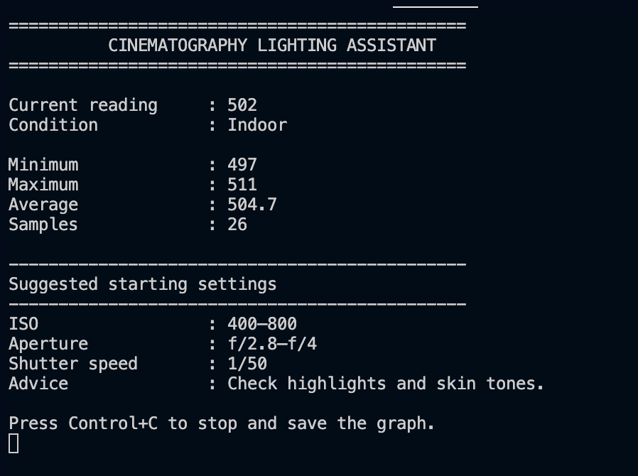
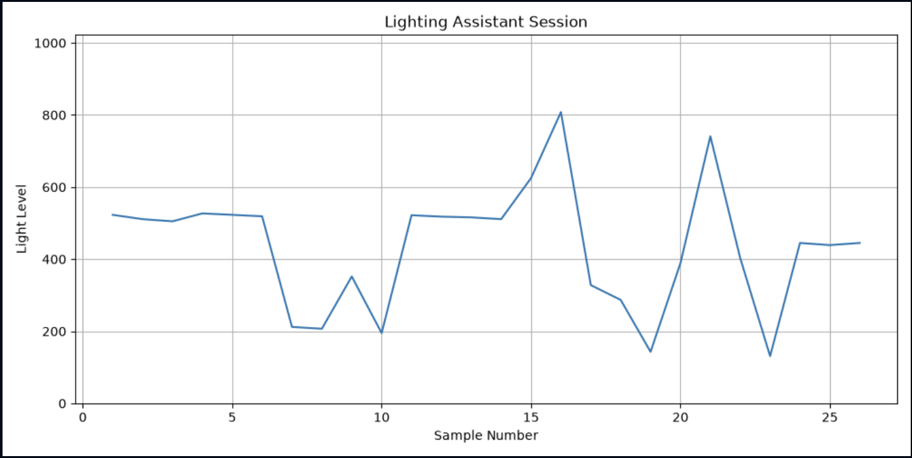
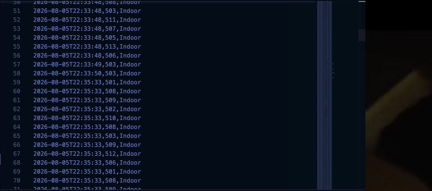

# 🎥 Cinematography Lighting Assistant

A hardware and software project that measures ambient light using an Arduino Uno and displays real-time lighting information in a Python application.

The project combines embedded systems, serial communication, data visualization, and software architecture into a single engineering project inspired by cinematography and photography workflows.

---

# Project Overview

The Cinematography Lighting Assistant continuously measures ambient light using a photoresistor connected to an Arduino Uno. The Arduino classifies the lighting conditions, provides immediate visual feedback using LEDs, and streams sensor data to a Python application over USB serial communication.

The Python application automatically detects the Arduino, displays a live dashboard, calculates real-time statistics, logs all measurements to a CSV file, generates graphs, and recommends starting camera settings based on the measured lighting conditions.

This project was built to learn embedded systems, hardware/software integration, modular Python development, and engineering design principles.

---

# Features

- 💡 Real-time ambient light sensing
- 🔴🟡🟢 LED lighting indicator
- 🔌 Automatic Arduino serial detection
- 📊 Live statistics
  - Current Reading
  - Minimum
  - Maximum
  - Running Average
  - Sample Count
- 💾 Automatic CSV logging
- 📈 Automatic session graph generation
- 🎬 Educational camera setting recommendations
- 🧩 Modular Python architecture
- ⚙️ Embedded Arduino firmware

---

# Skills Demonstrated

- Embedded Systems
- Arduino Programming
- Python Programming
- Serial Communication
- Sensor Integration
- Analog Signal Processing
- Data Logging
- Data Visualization
- Software Architecture
- Debugging Hardware & Software
- Git & GitHub

---

# Hardware Used

- Arduino Uno R3
- Breadboard
- Photoresistor (LDR)
- 10 kΩ resistor (Voltage Divider)
- Red LED
- Yellow LED
- Green LED
- 220 Ω resistors
- Jumper wires
- USB Cable

---

# Software Stack

### Arduino

Responsible for:

- Reading the photoresistor
- Classifying ambient light
- Driving LED indicators
- Sending structured serial data to Python

Example serial output:

```text
512,Indoor
684,Bright
953,Very Bright
```

---

### Python

Responsible for:

- Automatically detecting the Arduino
- Reading serial data
- Calculating live statistics
- Displaying a live dashboard
- Saving data to CSV
- Generating session graphs
- Recommending starting camera settings

---

# System Architecture

```text
                          Ambient Light
                                │
                                ▼
                     Photoresistor (LDR)
                                │
                                ▼
                 Arduino Uno R3 (Embedded System)
                                │
        ┌───────────────────────┼──────────────────────┐
        │                       │                      │
        ▼                       ▼                      ▼
 Read Analog Sensor      LED Indicators      Light Classification
                                │
                                ▼
                   USB Serial Communication
                                │
                                ▼
                 Python Desktop Application
                                │
      ┌──────────────┬──────────────┬──────────────┐
      ▼              ▼              ▼              ▼
 Dashboard      Statistics      CSV Logger     Session Graph
                                │
                                ▼
                  Camera Setting Recommendations
```

---

# Project Structure

```text
10-cinematography-lighting-assistant/

arduino/
└── lighting_assistant/
    └── lighting_assistant.ino

python/
├── main.py
├── config.py
├── serial_reader.py
├── analysis.py
├── display.py
├── storage.py
└── graphs.py

data/

graphs/

images/

README.md
requirements.txt
.gitignore
```

---

# Circuit


---

# Live Dashboard



---

# Session Graph



---

# CSV Output



---

# Example Dashboard

```text
==============================================
      CINEMATOGRAPHY LIGHTING ASSISTANT
==============================================

Current reading     : 527
Condition           : Indoor

Minimum             : 527
Maximum             : 541
Average             : 533.8
Samples             : 10

----------------------------------------------
Suggested starting settings
----------------------------------------------
ISO                 : 400–800
Aperture            : f/2.8–f/4
Shutter speed       : 1/50
Advice              : Check highlights and skin tones.

Press Control+C to stop and save the graph.
```

---

# Installation

Clone the repository.

```bash
git clone https://github.com/<your-username>/python-engineering.git
```

Navigate to the project.

```bash
cd 10-cinematography-lighting-assistant
```

Create a virtual environment.

```bash
python3 -m venv .venv
```

Activate the environment.

macOS / Linux

```bash
source .venv/bin/activate
```

Windows

```powershell
.venv\Scripts\activate
```

Install the dependencies.

```bash
pip install -r requirements.txt
```

Upload the Arduino sketch.

```text
arduino/lighting_assistant/lighting_assistant.ino
```

Run the Python application.

```bash
cd python
python3 main.py
```

---

# Current Capabilities

- Live ambient light monitoring
- Automatic Arduino detection
- Real-time statistics
- Session logging
- CSV export
- Automatic graph generation
- Camera setting recommendations

---

# Future Improvements

## Version 2

- Desktop GUI (Tkinter)
- Live updating graph
- OLED display
- Calibrated Lux Sensor
- Multiple camera profiles
- Exposure Value (EV) calculations
- Camera database
- Weather API integration
- Cloud synchronization
- Battery-powered portable version

---

# Lessons Learned

This project was my first complete hardware and software integration project.

Through building it, I gained experience with:

- Embedded programming
- Analog electronics
- Voltage divider circuits
- Sensor calibration
- Serial communication
- Modular Python architecture
- Data logging
- Data visualization
- Hardware debugging
- Software engineering workflows

One of the most valuable lessons from this project was learning to systematically debug hardware and software together. During development, a wiring issue caused by the breadboard power rails required isolating and testing each subsystem independently before integrating the complete system.

---

# Author

**Ryan Perera**

Mechanical & Industrial Engineering

University of Toronto

---

# License

This project is provided for educational and portfolio purposes.